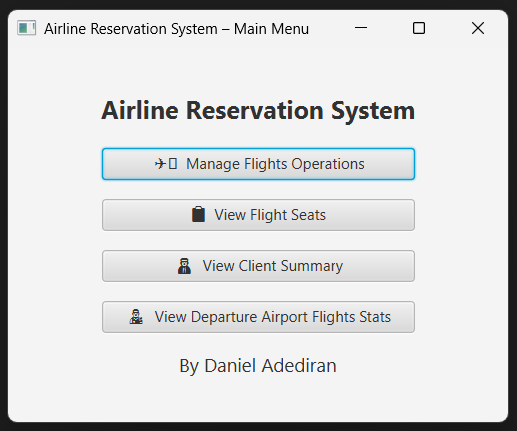
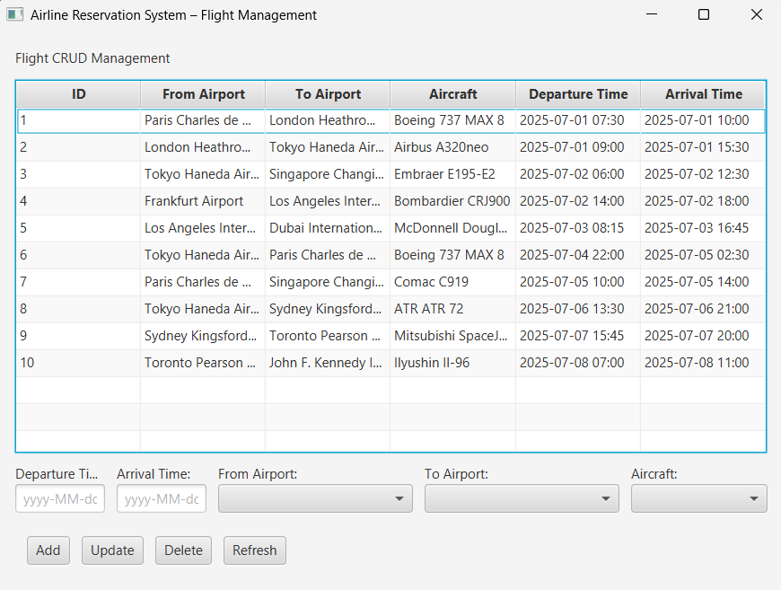
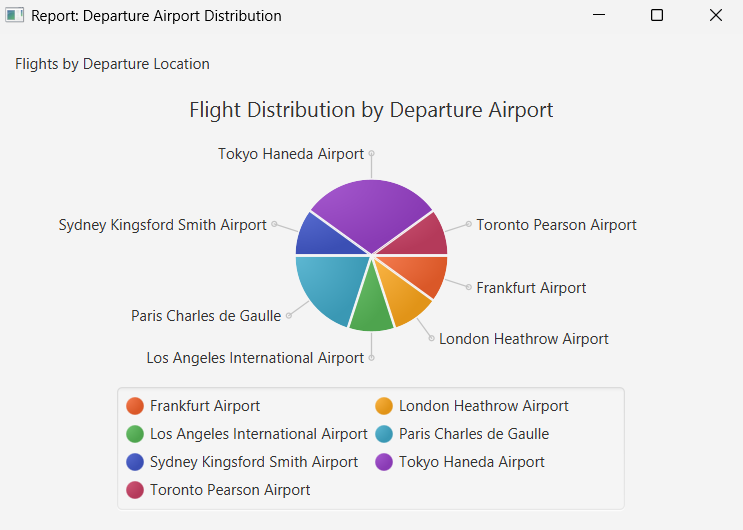
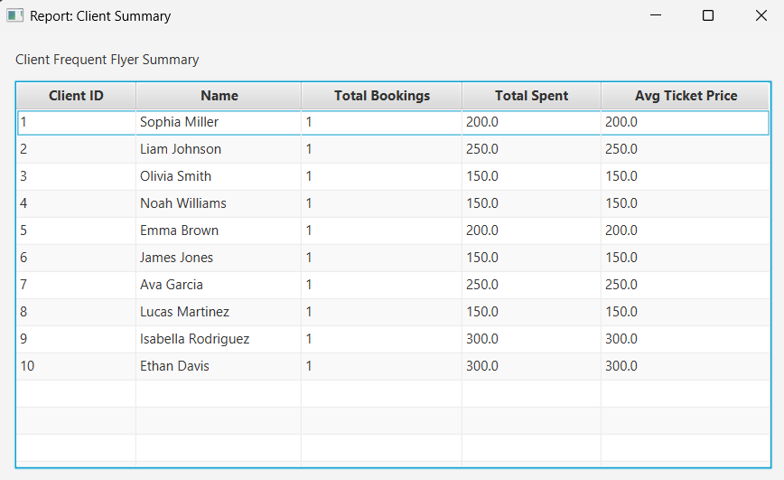
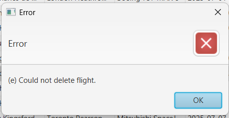

# ✈️ Airline Reservation System

## 📄 Application Description

This project is a **JavaFX-based mini-CRUD** application connected to a **MariaDB-backed** Airline Reservation
System database. Its purpose is to simulate the core operations of an airline, S

- Managing flight data (Create, Read, Update, Delete)
- Viewing operational summary reports generated from complex SQL views
- Viewing simple flight statistics

The application demonstrates the use of:
- **DAO design pattern** for database abstraction
- JavaFX for GUI
- SQL views for report generation
- Can be reconnected to another data source (CSV, another DB) easily

The backend is fully abstracted to support changes in the underlying data source (e.g., migrating from DB to CSV). SQL errors (e.g. invalid FK) are logged to the console, never exposed to the user interface.

## Flight CRUD Operations
1. The user opens the “Flight Operations Management” window.
2. A table displays existing flights (fetched from the database).
3. The user can:
   - Click **“Add”** to insert a new flight (departure & arrival time, aircraft to be used, departure & arrival airports).
   - Click **“Update”** to edit selected flight data.
   - Click **“Delete”** to remove a flight.
   - Click **“Refresh”** to reload fetched data.

---

## Entity Descriptions

The system is structured around core real-world components of airline operations:

- **flight**: A scheduled trip from one airport to another.
- **aircraft**: Airlanes used to operate flights, each with a type and registration.
- **aircraft_type** and **aircraft_manufacturer**: Define plane models and their manufacturers.
- **airport**, **city**, **country**: Location data for departures and arrivals.
- **client**: Individuals who book flights.
- **ticket**: Bookings made by clients for specific flights and seats.
- **employee**: Airline staff such as pilots, crew, and operations.
- **crew_role**: Defines what function each employee serves on a flight.
- **flight_crew**: Assignment of employees to flights in specific roles.
- **seat**, **seat_type**, **cabin_class**: Defines the seating layout inside aircraft.
- **aircraft_cabin_class**: Mapping of aircraft to their seating classes (e.g., Economy, Business).
- **payment**, **payment_method**, **payment_status**, **currency**: Tracks how bookings are paid for.
- **document_type**: Type of ID used during booking (e.g., Passport).
- **baggage**, **baggage_type**: Info about checked or carry-on bags.
- **boarding_pass**: Gate and seat info provided after check-in.
- **employee_assignment**, **department**, **job_position**: Defines internal staffing and structure.
- **gender**, **nationality**: Demographic information.

Each table is interlinked with foreign keys to simulate a real airline data environment.


## Database Assumptions
- Primary keys are **integer-based** and **auto-incremented** unless stated otherwise (e.g., **_ticket_id_** is a VARCHAR).
- Each **_flight_** is operated by one **_aircraft_** and can have many crew members and tickets.
- **_client_** and **_employee_** emails are assumed to be unique, but not strictly enforced in the DB.
- Each **_ticket_** is for one flight and one seat only.
- **Currency** is simplified to a single default **(EUR)** for all test data.
- Each **_employee_** is only assigned to one **_crew_role_** per flight in test data, but the schema allows for more.
- **_Payment_** is recorded in full, partial payments are not supported in this simplified model.
- No historical logging or soft deletes are implemented; deletions are hard deletes.
- Only Economy class is used in seating test data, but the schema supports multiple cabin classes.

---

## Report View Descriptions 

Displayed in JavaFX application

### `view_flight_seat_availability`
Shows number of available seats on each flight by subtracting booked seats from aircraft capacity.

**Joins:** `flight`, `aircraft`, `aircraft_cabin_class`, `seat`, `ticket`  
**Used in:** Report screen “Flights and Available Seats”

### `view_client_booking_summary`
Summarizes each client’s ticket bookings and payment totals.

**Joins:** `client`, `ticket`, `payment`  
**Used in:** Report screen “Client Frequent Flyer Summary”

### `view_flight_distribution_by_departure`
Shows distributions of flights from all departure aiports.

**Joins:** `flight`, `airport`  
**Used in:** Report screen “Departure Airport Flight Stats”

---

## Java Application Architecture

### Layers:
- **Model**: Plain Java Objects for `FlightSeatReport`, `ClientBookingSummary` & `AirportFlightStat`
- **DAO**: Clean separation of database logic with JDBC
- **View**: JavaFX screens, one per report + Flight CRUD

### GUI Screens:

| Screen | Preview |
|--------|---------|
| **Main Menu** |  |
| **Flight Management** |  |
| **Available Flight Seats Report** |  |
| **Departure Airport Flight Stat** |  |
| **Client Booking Report** |  |
| **Error Modal** |  |


---

## Project Structure

```
src/
 ├── dao/
 │    ├── FlightDAO.java
 │    ├── ViewDAO.java
 │    └── impl/ (implementations)
 ├── dep/
 │    ├── mariadb-java-client.jar
 ├── model/
 │    ├── Flight.java
 │    └── FlightSeatReport.java
 │    └── etc.
 ├── util/
 │    ├── DatabaseManager.java
 ├── view/
 │    ├── FlightCRUDView.java
 │    ├── EmployeeSummaryView.java
 │    └── etc.
 └── Main.java
```

---

## Requirements
1. XAMPP Control Panel
2. HeidiSQL
3. MariaDB Java Client
4. JavaFX SDK
5. Code Editing Environment (e.g Intellij IDEA, VSCode)

## Application Setup

1. Explore the **_Entity Relationship Diagram_**, **_Entity Descriptions_** and **_Database Assumptions_** to fully understand Database schema & logic.
2. Clone this repository.
3. Ensure **_xampp-control_** & **_heidisql_** are installed and setup properly.
4. Run the scripts in the sql folder in the following order:
   - **_DB-ddl.sql_**
   - **_report-views.sql_**
   - **_sample-data.sql_**
5. Run **_Main.java_** file in the **_/ARS-app/src_** folder to start application...


## Important Notes

- JavaFX must be properly linked using:
  ```
  --module-path /path/to/javafx-sdk/lib --add-modules javafx.controls
  ```
- Database must be running before launching the app
- Default DB settings:
  - Host: `localhost`
  - Port: `3306`
  - User: `root`
  - Password: ``
  - Database: `airline`

---

Developed by **[heisdanielade](https://www.heisdanielade.xyz/)**

---
